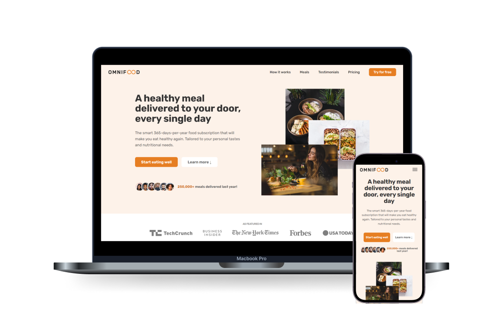

# [Omnifood Website Project](https://fondril.github.io/omnifood/)

Omnifood is a modern, responsive website designed to showcase a food delivery service. Built using HTML5, Tailwind CSS, JavaScript, and Git for version control, it provides a seamless, user-friendly experience across devices. I used this project to practice my HTML, Tailwind CSS, and design skills while ensuring a clean user interface.

## Features

- Fully responsive layout for mobile, tablet, and desktop
- Clean, minimalistic design with a focus on usability
- Smooth navigation and user interactions
- Optimized images for faster loading times
- Cross-browser compatibility, ensuring the website works seamlessly across different browsers

## Technologies Used

- HTML5: Structuring the webpage content with semantic elements
- Tailwind CSS: Styling the website with utility-first classes for responsive and consistent design
- JavaScript: Implementing interactive features
- Git: Version control to manage code changes and collaboration

## What I Learned

- Responsive Design: Gained hands-on experience with responsive web design, ensuring the website looks great on various screen sizes using Tailwind CSS utilities.
- Tailwind CSS: Deepened my understanding of utility-first CSS, speeding up development time and making it easier to manage the layout.
- HTML5 Semantics: Improved my skills in using semantic HTML5 elements, making the page more accessible and SEO-friendly.
- JavaScript Interactivity: Enhanced my ability to implement interactive elements like mobile navigation, boosting the user experience.
- Optimizing for Performance: Learned techniques to optimize images and assets for faster page load times, improving overall performance.
- Cross-Browser Compatibility: Ensured the website performs consistently across different browsers, enhancing accessibility and user experience.
